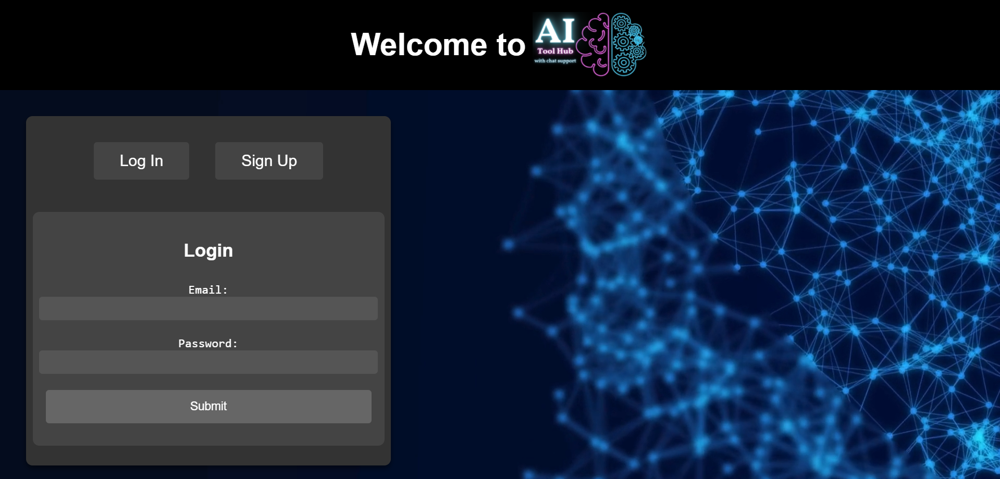
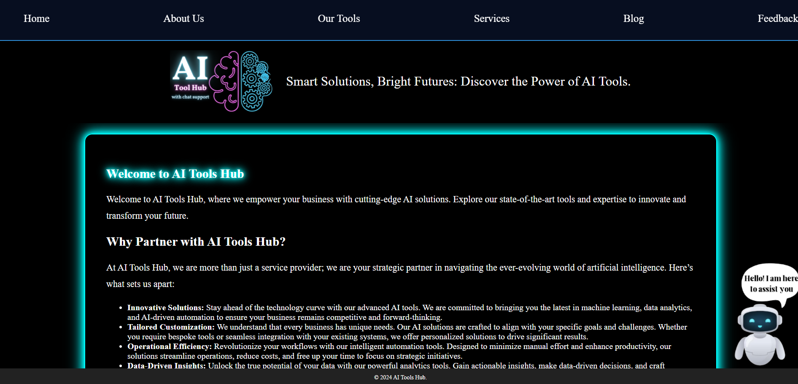
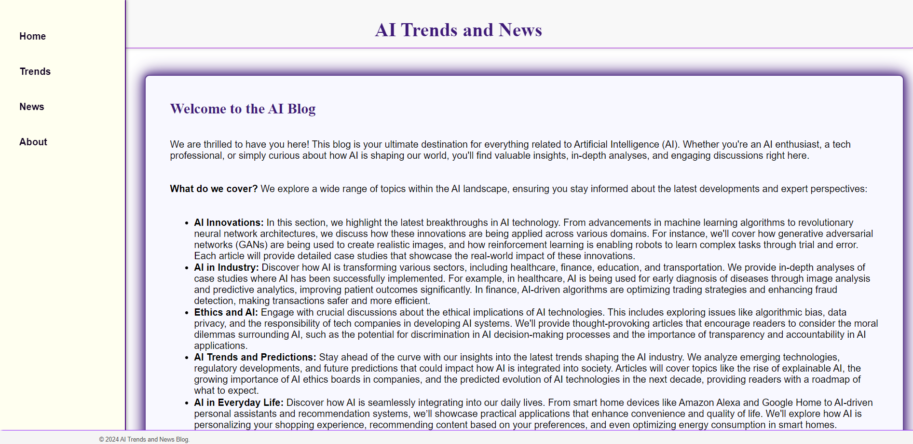
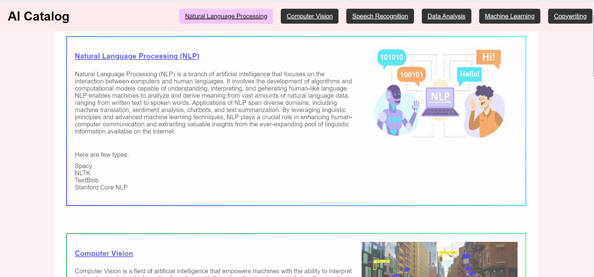
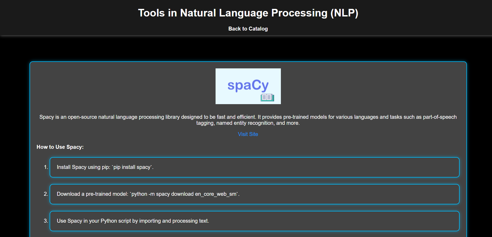
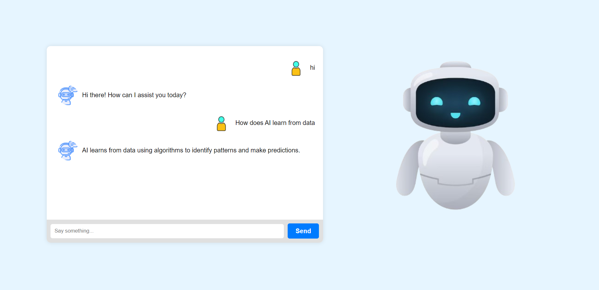

# AI Toolbox Hub

## Overview
The **AI Toolbox Hub** is a dynamic website that consolidates a wide range of artificial intelligence (AI) technologies. It aims to provide users with a central hub to explore and utilize various AI tools for data analysis, predictive analytics, machine learning algorithms, and more. The platform's user-friendly interface and robust database management system make AI-driven decision-making more accessible, efficient, and intuitive.

## Features
- **User-friendly Interface:** Built with HTML and CSS to offer a sleek and intuitive experience.
- **Real-time Interactivity:** Powered by JavaScript, allowing dynamic content updates on the client side.
- **Seamless Integration:** PHP is used for communication between front-end and back-end, ensuring efficient performance and data management.
- **AI Tools Variety:** Access to various AI tools, including predictive analytics, machine learning algorithms, and decision-support systems.
- **Database Management:** A well-designed database system guarantees fast, efficient data storage, retrieval, and management.

## Screenshots
Below are screenshots showcasing the key pages and features of the AI Toolbox Hub platform:

### 1. Login Page

The login page provides a secure and seamless way for users to sign into the platform. The simple design ensures that the login process is fast, and the platform uses encrypted passwords to keep user data safe.

### 2. Dashboard

The user dashboard allows individuals to manage their account settings, view their interaction history with AI tools, and track their progress. This centralized space ensures that users have quick access to all the features they use most frequently.

### 3. Blog Section

The blog section offers informative articles and tutorials on AI-related topics. Users can explore posts that cover the latest trends, guides, and innovations in artificial intelligence. The design is clean and reader-friendly, making it easy to follow along with the content.

### 4. Tools Section (Catalog)

This section presents a catalog of various AI tools available on the platform. Each tool is categorized for easy navigation, and users can learn more about each tool’s functionality and usage with just a click. The layout is designed to ensure that users can quickly find the right tool for their needs.

### 5. Homepage

The homepage of AI Toolbox Hub provides a clean and welcoming interface, introducing users to the platform’s core features. The navigation is intuitive, guiding users to explore the available AI tools, blogs, and chatbot assistance.

### 6. Chatbot Interface

The chatbot feature provides real-time assistance to users. Whether you’re looking for help navigating the platform or seeking guidance on using specific tools, the chatbot is always available to provide relevant answers. This screenshot shows the chatbot's interface, which is simple yet highly responsive, improving user interaction.

## Blog Section
The platform includes a **Blog Section**, where users can explore informative articles and tutorials on AI-related topics. This section helps users stay updated with the latest trends, guides, and innovations in artificial intelligence. The blog is a great resource for anyone looking to deepen their understanding of AI technologies.

## Chatbot Feature
A **Chatbot** is integrated into the platform to assist users with queries regarding the tools, features, and functionalities of the AI Toolbox Hub. The chatbot enhances user experience by providing real-time guidance and support. It’s especially useful for newcomers who may need assistance navigating the platform or understanding the features.

## Technologies Used
- **Frontend:** HTML, CSS, JavaScript
- **Backend:** PHP
- **Database:** Database Management System (DBMS)
- **AI Tools:** Predictive analytics, machine learning algorithms

  
##Getting Started
To set up and run the project locally:
1. Clone the repository.
2. Set up a local server (e.g., XAMPP, WAMP).
3. Ensure PHP and MySQL are installed.
4. Run the project on the server.
5. Access the platform via `localhost`.

To set up the backend database, you can use the following SQL scripts to create the necessary tables for user management, tools, blog posts, and chatbot interactions:

```sql
-- Table for storing user information
CREATE DATABASE IF NOT EXISTS ai_tools;

USE ai_tools;

-- Table for storing user information
CREATE TABLE users (
    user_id INT AUTO_INCREMENT PRIMARY KEY,
    name VARCHAR(50) NOT NULL,
    last_name VARCHAR(50) NOT NULL,
    gender ENUM('Male', 'Female', 'Other') NOT NULL,
    email VARCHAR(100) NOT NULL UNIQUE,
    password VARCHAR(255) NOT NULL,
    created_at TIMESTAMP DEFAULT CURRENT_TIMESTAMP
);

USE ai_tools;

-- Table for storing user feedback
CREATE TABLE feedback (
    feedback_id INT AUTO_INCREMENT PRIMARY KEY,
    name VARCHAR(100) NOT NULL,
    email VARCHAR(100) NOT NULL,
    message TEXT NOT NULL,
    submitted_at TIMESTAMP DEFAULT CURRENT_TIMESTAMP
);

---

Elevate your decision-making capabilities by unlocking the potential of AI tools through the AI Toolbox Hub—your gateway to a smarter, data-driven future.
